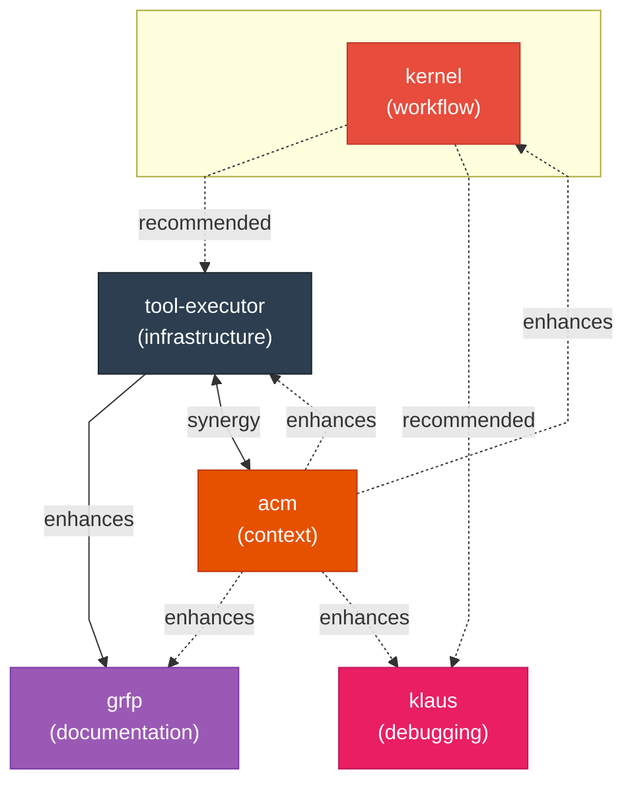

<p align="center">
  <a href="LICENSE"></a>
  
  
</p>

# Claudikins Marketplace

A complete toolkit for Claude Code.

<details>
<summary><strong>Table of Contents</strong></summary>

- [Quick Install](#quick-install)
- [Plugin Ecosystem](#plugin-ecosystem)
- [Prerequisites](#prerequisites)
- [Getting Started](#getting-started)
- [Plugins](#plugins)
- [Kernel](#kernel)
- [Tool Executor](#tool-executor)
- [GRFP](#grfp)
- [klaus](#klaus)
- [ACM](#acm)
- [Recommended Combinations](#recommended-combinations)
- [Contributing](#contributing)
- [License](#license)

</details>

## Quick Install

```bash
claude plugins:add https://github.com/elb-pr/claudikins-marketplace
```

## Plugin Ecosystem



**kernel** is the recommended starting point - it orchestrates the full development workflow. **tool-executor** provides MCP infrastructure that enhances grfp's Gemini integration. **acm** preserves context across all plugins. **klaus** pairs well with kernel for debugging sessions.

## Prerequisites

Claude Code is required for all plugins (latest version recommended).

| Plugin        | Requirements                                                |
| ------------- | ----------------------------------------------------------- |
| kernel        | `jq`, `git`, `sha256sum`, `find`                            |
| tool-executor | Node.js 18+, configured MCP servers                         |
| grfp          | None (tool-executor strongly recommended for Gemini access) |
| klaus         | None                                                        |
| acm           | None                                                        |

## Getting Started

Choose your path based on what you want to accomplish.

### Full Development Workflow

**For:** Users who want structured planning, execution, and shipping.

```bash
# Install the core workflow with MCP tools and context preservation
claude plugins:add claudikins-marketplace/kernel
claude plugins:add claudikins-marketplace/tool-executor
claude plugins:add claudikins-marketplace/acm
```

**What you get:** 4-command pipeline (plan, execute, verify, ship), MCP tool access without context bloat, and automatic context preservation for long sessions.

### Documentation Focus

**For:** Users who want high-quality READMEs.

```bash
# Install the README pipeline with Gemini research
claude plugins:add claudikins-marketplace/grfp
claude plugins:add claudikins-marketplace/tool-executor
```

**What you get:** 5-phase README pipeline (deep-dive, crystal-ball, brain-jam, think-tank, pen-wielding) with Gemini-powered research and creative brainstorming.

### Debugging Sessions

**For:** Users tackling hard bugs.

```bash
# Install systematic debugging with context preservation
claude plugins:add claudikins-marketplace/klaus
claude plugins:add claudikins-marketplace/acm
```

**What you get:** 8-phase systematic debugging methodology, plus context preservation for long debugging sessions.

## Plugins

| Plugin                          | Category       | Description                                                                                         |
| ------------------------------- | -------------- | --------------------------------------------------------------------------------------------------- |
| [kernel](#kernel)               | Workflow       | 4-command pipeline with isolated agents, cross-command gates, and JSON state persistence            |
| [tool-executor](#tool-executor) | Infrastructure | Meta-MCP server with semantic tool search, sandboxed TypeScript execution, and workspace API        |
| [grfp](#grfp)                   | Documentation  | 5-phase README pipeline: deep-dive, crystal-ball, brain-jam, think-tank, pen-wielding               |
| [klaus](#klaus)                 | Debugging      | 8-phase systematic debugging wrapped in theatrical Germanic exasperation and imaginary Pong         |
| [acm](#acm)                     | Context        | Monitors usage, triggers at threshold, generates structured handoffs preserving state and decisions |

---

## Kernel


**Repository:** [claudikins-kernel](https://github.com/elb-pr/claudikins-kernel)

Four commands that enforce quality through gates:

- `/claudikins:kernel-plan` - Iterative requirements gathering, parallel research agents, multiple approaches with trade-offs, section-by-section drafting
- `/claudikins:kernel-execute` - Tasks run in isolated git branches with fresh context. Two-stage review: spec compliance first, code quality second
- `/claudikins:kernel-verify` - Runs your code and watches it work. The catastrophiser agent observes actual output, not just test results
- `/claudikins:kernel-ship` - Documentation updates via GRFP methodology, commit message drafting, PR creation with human approval at every stage

Cross-command gates prevent skipping steps. State persists to JSON for session resume. File hashes ensure you ship what you verified.

**Works best with:** [tool-executor](#tool-executor) (MCP access), [klaus](#klaus) (debugging), [acm](#acm) (context preservation). Kernel is recommended for all plugins.

---

## Tool Executor


**Repository:** [claudikins-tool-executor](https://github.com/elb-pr/claudikins-tool-executor)

MCP tools eat context. A typical setup with 5-6 servers burns 25% of your context window just listing available tools.

Tool Executor wraps multiple MCP servers behind three tools:

- `search_tools` - Semantic search across all registered servers
- `get_tool_schema` - Fetch full schema only when needed
- `execute_code` - Sandboxed TypeScript runtime with access to MCP clients and a persistent workspace API

Context usage drops to 0.5%. Large responses auto-save to workspace. You get the tools without the bloat.

**Works best with:** [kernel](#kernel) (workflow orchestration), [grfp](#grfp) (Gemini access), [acm](#acm) (synergy - context efficiency meets preservation).

---

## GRFP


**Repository:** [claudikins-grfp](https://github.com/elb-pr/claudikins-github-readme-for-perfectionists)

Five phases. Two AIs. One README that reads like a human wrote it.

1. **Deep-dive** - Extract facts from the codebase: tech stack, entry points, dependencies, friction points
2. **Crystal-ball** - Identify what the project could become: performance opportunities, feature gaps, technical debt
3. **Brain-jam** - Multi-turn conversation with Gemini to find the right angle and voice
4. **Think-tank** - Gemini deep research on exemplar READMEs, pattern extraction, anti-pattern identification
5. **Pen-wielding** - Section-by-section writing with anti-slop filtering and style enforcement

Claude handles analysis and writing. Gemini runs deep research and creative brainstorming. The pipeline enforces quality at every stage.

**Works best with:** [tool-executor](#tool-executor) (strongly recommended for Gemini MCP access). Can run standalone but benefits significantly from tool-executor.

---

## klaus


**Repository:** [claudikins-klaus](https://github.com/elb-pr/claudikins-klaus)

For when you are truly, catastrophically doomed.

klaus is a dramatically irritated debugging persona with Eastern European flair. He fixes your code while narrating an imaginary Pong championship match against you. Every bug you create scores him a point. Every fix you accept scores you one.

The persona is absurd. The methodology is rigorous:

8 systematic phases covering hypothesis formation, evidence gathering, isolation testing, and root cause analysis. klaus applies extreme rigour while lamenting your life choices and celebrating his Pong dominance.

**Works best with:** [kernel](#kernel) (debugging companion for kernel workflows), [acm](#acm) (preserves progress in long sessions). Recommended for kernel users.

---

## ACM


**Repository:** [claudikins-automatic-context-manager](https://github.com/elb-pr/claudikins-automatic-context-manager)

Context fills up. Work gets lost. Sessions end mid-task.

ACM monitors context usage and triggers at a configurable threshold (default 60%). When triggered, it generates a structured handoff summary:

- Current task state
- Decisions made and why
- Files modified
- Next steps to continue

New session loads the summary and picks up where you left off. Configurable threshold, snooze duration, and summary length. Works alongside other plugins without conflict.

**Works best with:** All plugins - ACM enhances everything by preserving context across sessions. Particularly strong synergy with [tool-executor](#tool-executor).

---

## Recommended Combinations

**Full workflow coverage:** kernel + tool-executor + acm

Kernel handles the development lifecycle. Tool-executor keeps MCP tools from eating context. ACM saves your work when context fills.

**Documentation focus:** grfp + tool-executor

GRFP uses Gemini for deep research. Tool-executor provides the MCP access.

**Debugging sessions:** klaus + acm

klaus for the hard problems. ACM to preserve progress when the session runs long.

---

## Contributing

Want to add your plugin to the marketplace? Here's what you need.

### Plugin Requirements

- **Own repository** - Your plugin must be hosted in its own git repository
- **README** - Include installation instructions and usage documentation
- **Claude Code conventions** - Follow the standard plugin structure (commands in `commands/`, skills in `skills/`)
- **Description** - Keep it under 100 characters for display in the marketplace

### Submission Process

1. Fork this repository
2. Add your plugin to `.claude-plugin/marketplace.json`:

```json
{
  "name": "your-plugin-name",
  "source": {
    "source": "url",
    "url": "https://github.com/your-username/your-plugin.git"
  },
  "description": "Brief description of what your plugin does.",
  "version": "1.0.0"
}
```

3. Open a PR with a brief description of your plugin

That's it. We'll review and merge if everything looks good.

## License

MIT
